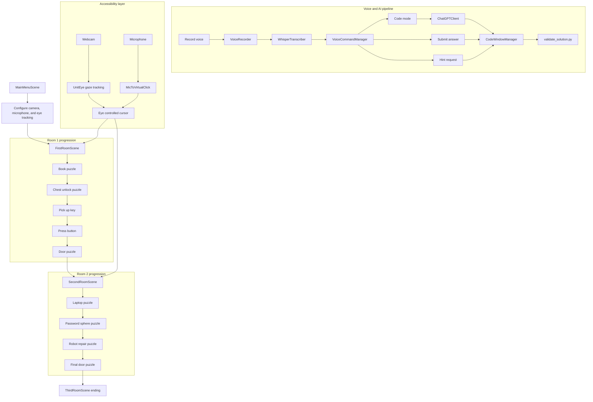

# EscapeCode

EscapeCode is a Unity 6 3D escape-room game that combines programming puzzles, AI-assisted guidance, eye tracking, and voice-driven interaction. The player progresses through multiple rooms by solving Python-style challenges, unlocking new objects, and using accessibility-focused input systems such as gaze control and microphone-triggered clicks.

This repository contains the final project version of the game, including the playable Unity project, the AI integration layer, the bundled Python validator, and the supporting academic material.

## How To Play

If you just want to play the game and not open the Unity project, download the latest Windows build from the repository Releases page:

- `GitHub -> Releases -> latest EscapeCode Windows build`

Player notes:

- Extract the downloaded `.zip`
- Open `EscapeCode.exe`
- No Unity installation is required for the playable build
- All Ai communications are disabled for this version because API key is required

## Overview

- Genre: 3D escape room / educational serious game
- Engine: Unity 6
- Core theme: solve coding puzzles to escape each room
- Input modes: mouse, eye tracking, voice commands, microphone click
- AI role: contextual puzzle help and spoken-input formatting

## Highlights

- Multi-room progression with puzzle dependencies and scene transitions
- Python-based answer validation through a bundled runtime in `StreamingAssets`
- OpenAI-powered assistant for transcription and in-game puzzle support
- Eye tracking support via UnitEye and MediaPipe-based packages
- Microphone loudness to virtual click interaction
- Hint glow system for guiding the player toward the next interactable object
- Cinemachine camera focus moments for important puzzle events

## Gameplay And System Flow



## Core Gameplay Loop

1. The player starts in `MainMenuScene` and configures the available camera and microphone devices.
2. The game begins in `FirstRoomScene`, where solving one coding puzzle unlocks the next object in the room.
3. The player can ask for hints, switch to code mode, or submit answers through the in-game AI assistant flow.
4. Correct answers are validated locally through a bundled Python script.
5. Completing the final puzzle in each room advances the player to the next scene.

## Room Progression

### Room 1

- `BookInteraction` opens the first puzzle.
- Solving the book puzzle reveals the chest.
- Solving the chest puzzle reveals the key.
- Picking up the key unlocks access to the door sequence.
- Pressing the button and solving the final door puzzle loads `SecondRoomScene`.

### Room 2

- `LaptopInteraction` starts the server-count puzzle.
- The password sphere puzzle activates the robot sphere.
- The robot repair puzzle restores the big robot system.
- Solving the final door puzzle loads `ThirdRoomScene`.

### Room 3

- `ThirdRoomScene` is the completion scene reached after the second room finale.

## AI And Accessibility Features

### Voice Assistant

The in-game assistant is built around these components:

- `VoiceRecorder` records player speech into a WAV file
- `WhisperTranscriber` sends audio to OpenAI transcription
- `VoiceCommandManager` interprets the transcription
- `ChatGPTClient` provides contextual puzzle guidance
- `CodeWindowManager` streams chat, handles code mode, and submits answers

The assistant is designed to help the player without directly giving away puzzle solutions. In code mode, it focuses on formatting or correcting the player's spoken guess instead of solving the puzzle outright.

### Voice Commands

The codebase explicitly supports commands such as:

- `hint`
- `code mode`
- `normal mode`
- `submit`

### Eye Tracking

Eye tracking is connected through UnitEye and related MediaPipe/Barracuda packages. When enabled, the project can use webcam-based gaze estimation to drive cursor-based interaction.

### Microphone Click

`MicToVirtualClick` monitors microphone loudness and translates audio peaks into left mouse clicks. This makes the interaction model more accessible, especially when paired with eye tracking.

## Project Structure

| Path | Purpose |
| --- | --- |
| `Assets/Scenes` | Main playable scenes used in build settings |
| `Assets/Scripts` | Main gameplay, UI, puzzle, and interaction logic |
| `Assets/Scripts/AiBot` | OpenAI integration, transcription, recording, and puzzle context |
| `Assets/Scripts/SecondRoomScripts` | Second room puzzle flow and robot logic |
| `Assets/StreamingAssets/Python` | Bundled Python runtime and `validate_solution.py` |
| `Assets/StreamingAssets/Calibration Files` | Calibration data used by the gaze system |
| `Assets/Resources` | Runtime-loaded assets such as `openai_config.json` |
| `Packages/UnitEye` | Gaze tracking package |
| `Packages/HolisticBarracuda` | Holistic / MediaPipe inference support |
| `ProjectSettings` | Unity project configuration |

## Tech Stack

- Unity `6000.0.43f1`
- Universal Render Pipeline
- Cinemachine
- Unity Input System
- NavMesh navigation
- UnitEye
- HolisticBarracuda / MediaPipe-related packages
- OpenAI Chat Completions API (`gpt-4o`)
- OpenAI Audio Transcriptions API (`whisper-1`)
- Bundled Windows Python runtime for answer validation

## Setup

### Requirements

- Windows machine
- Unity Hub with Unity `6000.0.43f1`
- Webcam for gaze tracking features
- Microphone for voice commands and microphone click
- Internet access for OpenAI-based features
- OpenAI API key

### OpenAI Configuration

The project loads the API key from `Assets/Resources/openai_config.json`.

Use the following format:

```json
{
  "openai_api_key": "YOUR_OPENAI_API_KEY"
}
```

Important:

- Do not commit a real API key into version control.
- Without this file, the AI chat and voice transcription features will not work.

### Build Notes

- The current implementation is Windows-oriented because it uses `user32.dll` mouse events and a bundled Windows Python executable.
- Puzzle validation runs locally through `Assets/StreamingAssets/Python/validate_solution.py`.
- The main scene flow defined in build settings is:
  - `MainMenuScene`
  - `FirstRoomScene`
  - `SecondRoomScene`
  - `ThirdRoomScene`

## Important Scripts

- `Assets/Scripts/CodeWindowManager.cs`: puzzle window UI, chat stream, Python validation
- `Assets/Scripts/AiBot/VoiceCommandManager.cs`: voice flow, hint detection, mode switching, submit handling
- `Assets/Scripts/AiBot/ChatGPTClient.cs`: OpenAI chat requests with puzzle context
- `Assets/Scripts/AiBot/WhisperTranscriber.cs`: speech-to-text transcription
- `Assets/MicToVirtualClick.cs`: microphone loudness to click bridge
- `Assets/Scripts/GlowEffect.cs`: delayed hint glow behavior
- `Assets/Scripts/SecondRoomScripts/BigRobotRepairInteraction.cs`: second-room robot activation sequence

## Additional Material

- [Project Book](./Book%20Project.pdf)
- [Project Presentation](./EscapeCode-A-Programming-Presentation.pptx)

## Current Limitations

- The OpenAI key is file-based, which is convenient for development but not ideal for production security.
- The accessibility pipeline is tightly coupled to Windows-specific behavior.
- Puzzle validation is currently based on a predefined local validator script rather than a more extensible content system.

## Summary

EscapeCode is a hybrid of escape-room gameplay, beginner-friendly coding puzzles, and accessibility-oriented interaction design. Its most distinctive aspect is the way it combines room-based puzzle progression with eye tracking, microphone click input, and an AI assistant that helps the player interact with coding challenges in a more natural way.
